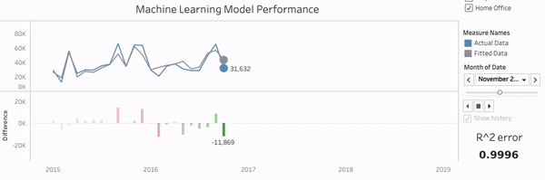
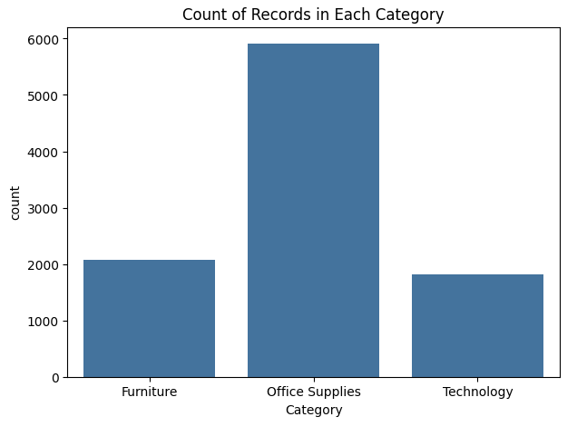
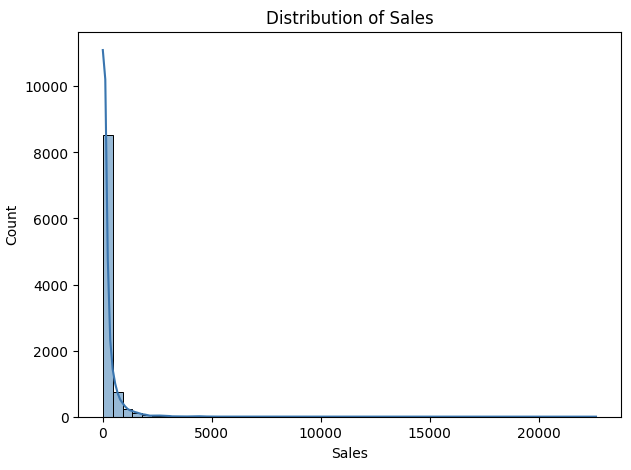
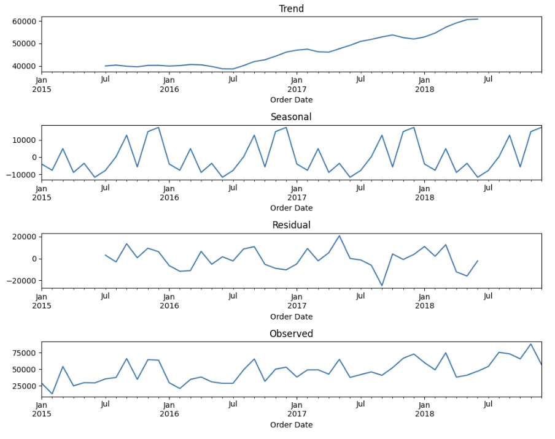
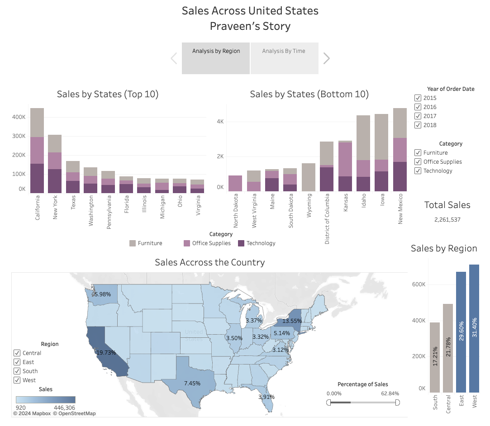
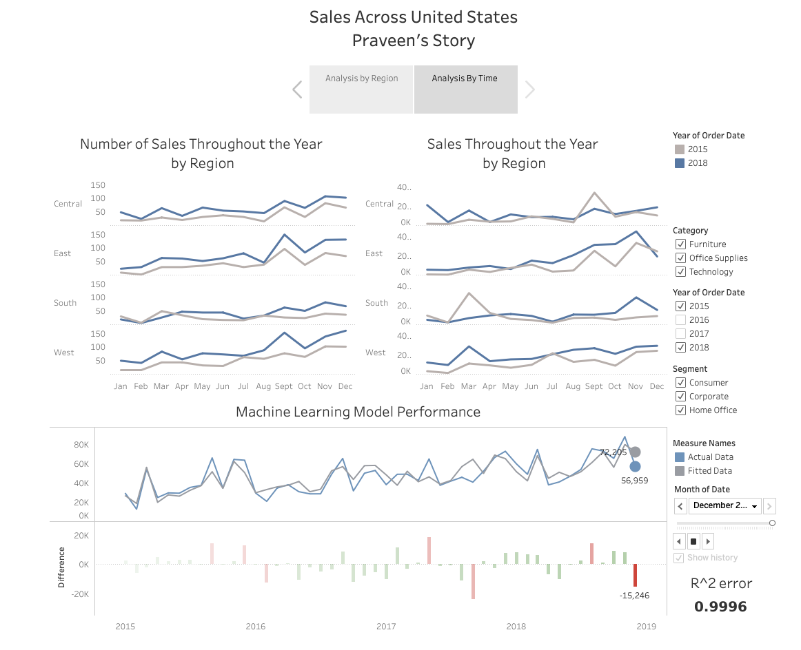

# Live Forecasting and Analytics

## Overview


In Wyoming, cozy couches trump high-tech gadgets in sales, while California, New York, and Texas witnessed a flourishing tech sales scene. The holiday season emerged as the pinnacle of annual sales excitement.

Surprisingly, even the combined forces of the Dakotas found themselves at the bottom of the sales ladder in the central and south regions. But wait, there's more to the tale...

Every dataset harbors millions of untold stories, waiting to be unraveled and interpreted. I leveraged tableau dashboards to unfold my narrative within the sales dataset, offering strategic insights and revealing nuanced patterns. 

When it comes to sales, there are some crucial questions. 

1. What strategies drive the highest revenue? 
2. Which regions prove to be the most lucrative? 
3. How does consumer behavior influence purchasing patterns?
4. How do external factors, such as economic trends or technological advancements, impact the sales landscape and necessitate adaptive strategies for sustained success?
5. What innovative approaches can be employed to boost overall sales performance?
6. And, perhaps most importantly, can we **forecast** the sales?

<p align="center">
  
</p>


### Link to the interactive [ Tableau workbook](https://public.tableau.com/views/Salesbook_17062297624770/SalesacrossUS-PraveensVisualization?:language=en-GB&publish=yes&:display_count=n&:origin=viz_share_link)


# Lets Begin :)

## Data Preprocessing

The dataset underwent comprehensive preprocessing steps, addressing missing values, converting data types, and performing feature engineering. Missing values in the "Postal Code" column were filled using the mode within the same city. Date columns ("Order Date" and "Ship Date") were converted to datetime objects for time-based analysis. Categorical variables were converted to the 'category' data type for efficiency. Unnecessary columns were removed, and "Sales" was transformed to log scale for stability. Feature engineering extracted information from date columns, enriching the dataset for time-related patterns.

## Visualizations

Exploratory Data Analysis (EDA) involved visualizations to gain insights into the data. Key plots included sales trends over time, regional sales distribution, and category-wise sales breakdown. Additional visualizations showcased top and bottom states by sales, providing a comprehensive understanding of the dataset.

Here are few significant plots

<p align="center">
  
  
</p>

*First plot shows the number of purchases in each category and the second plot shows that most of the purchases made are between $0 - $2000*


  <p align="center">
  
</p>

*This plot provides evidence that there is a significant trend observed and we can proceed with Time Series Forecast*


## Model Training

The Jupyter Notebook `Sales_Analytics_MyView.ipynb` guides the model training process, covering loading data, preprocessing, training the Prophet model, and making predictions. The trained model is saved as `prophet_model.pkl`.

## Loading the Saved Model

```python
from fbprophet import Prophet
import pickle

# Load the Prophet model
with open('prophet_model.pkl', 'rb') as model_file:
    loaded_model = pickle.load(model_file)
    


# Use the loaded_model for predictions
```

# Tableau Storybook for Sales Analysis


This Tableau Storybook provides visual insights into the sales analysis based on a four-year dataset. It is divided into two dashboards, each focusing on different aspects of sales.

## Dashboard 1: Analyze Sales by Region

*Note: The images here are not interactive, the interactive dashboards can be found here [ Tableau workbook](https://public.tableau.com/views/Salesbook_17062297624770/SalesacrossUS-PraveensVisualization?:language=en-GB&publish=yes&:display_count=n&:origin=viz_share_link)* 


<p align="center">
  
</p>


- Filters by year and category are available.
- Dark blue indicates high sales.
- Filters by region are available.
- Percentage of sales is indicated.

In analyzing the top 10 states by sales, it is evident that these high-performing states consistently contribute significantly to the total sales, implying a crucial role in overall revenue generation and indicating robust economic activity. Conversely, the examination of the bottom 10 states reveals regions with lower sales, emphasizing the importance of identifying these areas to guide targeted efforts, improve market presence, and increase sales. The visualization of sales distribution using a US map highlights dark blue regions representing higher sales, providing a visual representation of economic strength across the country. States making substantial contributions to sales are identified by labels (exceeding 3%). This insight aids strategic decision-making and resource allocation by identifying regions with greater market potential and economic activity.


## Dashboard 2: Analyze Sales Over Time

*Note: The images here are not interactive, the interactive dashboards can be found here [ Tableau workbook](https://public.tableau.com/views/Salesbook_17062297624770/SalesacrossUS-PraveensVisualization?:language=en-GB&publish=yes&:display_count=n&:origin=viz_share_link)* 

<p align="center">
  
</p>

- Filters by category and segment are available.
- Model R2 error: 0.996.


In the second dashboard, focused on the temporal analysis of sales trends over time, it is observed that the number of sales throughout the year exhibits varying patterns, showcasing fluctuations indicative of seasonal trends. Recognizing these seasonal trends becomes crucial for effective inventory management, strategic promotional planning, and meeting customer demands during peak seasons. The examination of sales in USD throughout the year reveals an overall positive growth trend across all regions from 2015 to 2018, suggesting the effectiveness of implemented sales strategies and successful market expansion efforts.

The comparison between predicted and actual sales demonstrates a close alignment, with the predictive model displaying high accuracy (R2 error of 0.996). This indicates the reliability of the model for future sales forecasting, providing valuable insights for strategic decision-making. Moreover, the minimal variations between actual and predicted values further strengthen confidence in the model's precision.

An additional observation from the first two plots emphasizes a significant surge in sales during the last quarter of the year, likely attributed to the holiday season. This insight underscores the importance of implementing targeted sales strategies during other months to maintain consistent performance throughout the year. In conclusion, the temporal analysis provides insights into seasonal trends, growth patterns, and the accuracy of predictive modeling, contributing to informed decision-making for strategic business success.


## Usage

- Open the Tableau workbook file `SalesBook.twb` to explore the visualizations.
- Interact with filters to drill down into specific data subsets.
- Gain insights into regional sales trends, top and bottom-performing states, and the accuracy of the sales prediction model.

## Notes

- The Tableau workbook is interactive, allowing users to dynamically explore and analyze sales data.
- Feel free to customize the filters, tooltips, or any other aspect to meet specific requirements.

## References

- Prophet documentation: https://facebook.github.io/prophet/docs/
- Tableau: https://www.tableau.com/
- Storytelling with data: https://youtu.be/8EMW7io4rSI?si=x0_XHnmtqesaYjXt

Feel free to reach out if you have any questions or suggestions :)
